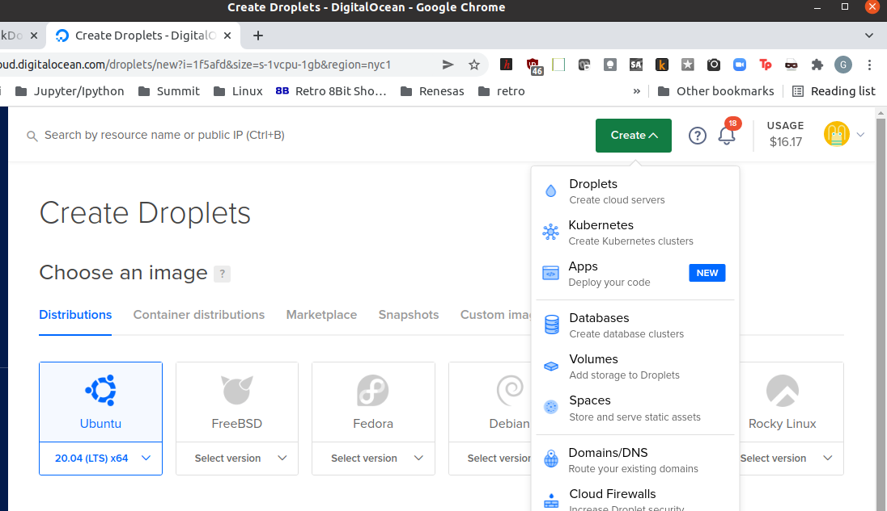
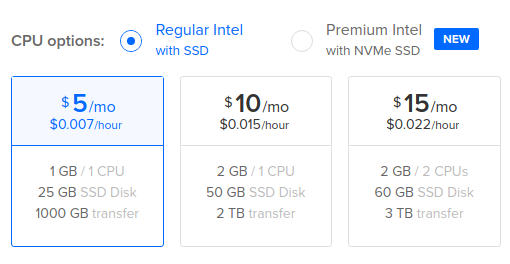
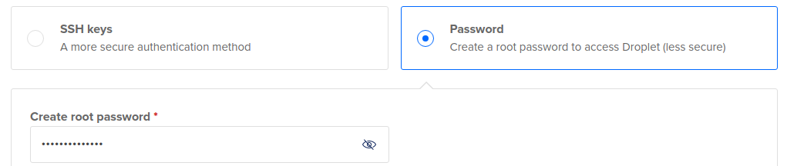

# Set up a Digital Ocean server

Create a new account with $100/60 day credit [digital ocean](https://try.digitalocean.com/open-source/?utm_medium=podcast&utm_source=pythonbytes&utm_campaign=Core_DO_SS_Cold).
Would also highly recommend you check out the podcast [Pythonbytes](https://pythonbytes.fm/), from where this discount comes.

## Create a new droplet
Choose Ubuntu 20.04(LTS)x64 Distribution

Select Regular Intel w/SSD for $5/month

Create password Authentication.
Do not create New SSH key.  You will do this from your linux client.

Click green bar Create Droplet

## Initial Server Setup

Follow digital ocean [Initial Setup](https://www.digitalocean.com/community/tutorials/initial-server-setup-with-ubuntu-20-04) tutorial

From linux pc client

    $ ssh root@211.211.211.211    # Enter your new static IP address provided by Digital Ocean

Now you are logged in to your digital ocean server as root

From [UFW Essentials Guide](https://www.digitalocean.com/community/tutorials/ufw-essentials-common-firewall-rules-and-commands)

    $ adduser geddy
    $ usermod -aG sudo geddy
    $ ufw allow OpenSSH
    $ ufw enable

## Create ssh key pair on linux PC client and copy to server
From [SSH Key Creation](https://www.digitalocean.com/community/tutorials/how-to-set-up-ssh-keys-on-ubuntu-20-04) tutorial

    $ ssh-keygen -l   # enter tnfs when prompted
    $ ssh-copy-id geddy@211.211.211.211

## Setup ~/.ssh/config on client PC
    $ nano ~/.ssh/config

    Host tnfs*
        HostName        211.211.211.211
        User            geddy
        IdentityFile    ~/.ssh/tnfs

    $ ssh tnfs       # now you have a shortcut to ssh from client into your server
## Disable Password Authentication on server
    $ sudo nano /etc/ssh/sshd_config
    PasswordAuthentication no   # then cntl-x and save 
    $ sudo service ssh restart

