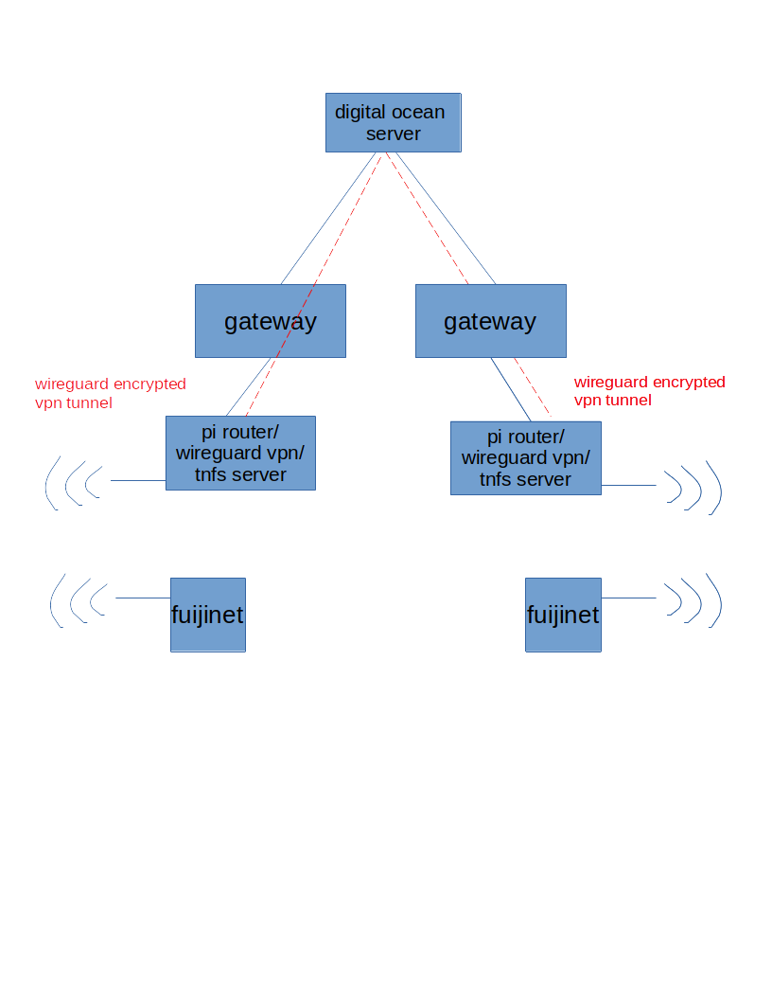

# Welcome to TFNSpi

For repository of these instructions see [github tnfspi](https://github.com/grkidwell/tnfspi)

## Components

1. Digital Ocean server as central hub of wireguard network

2. Ubuntu Server on Raspberry Pi

3. Autossh reverse ssh tunnel between raspberry pi and digital ocean server for maintenance.

4. Wireguard to create secure encrypted VPN tunnel between multiple TNFS servers /Fujinet devices

5. ZFS filesystem and Sanoid to automate rolling snapshots of tnfs data

6. TNFS to share Atari disk images over Fujinet

7. Samba to easily transfer files over both local network and wireguard vpn 
 
8. Network Manager to easily turn the pi into an access point to wirelessly communicate with Fujinet device 

## Architecture
