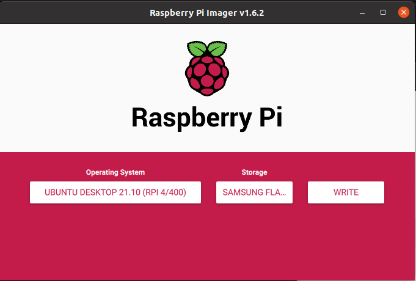
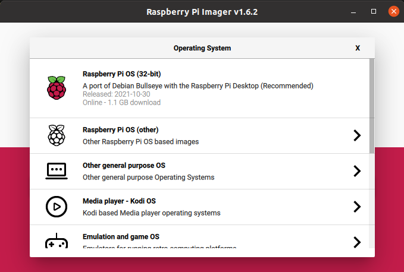
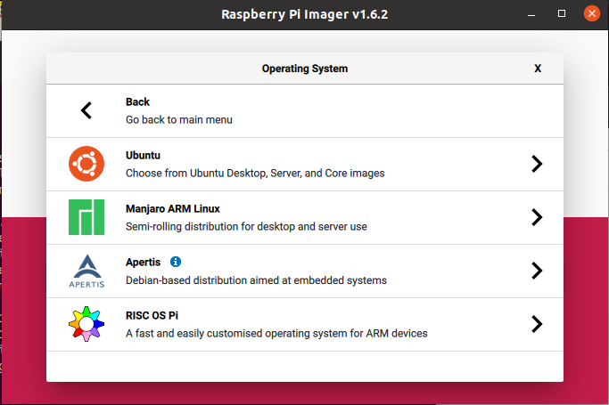
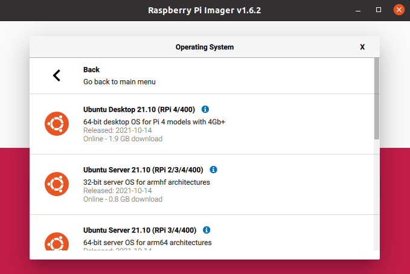
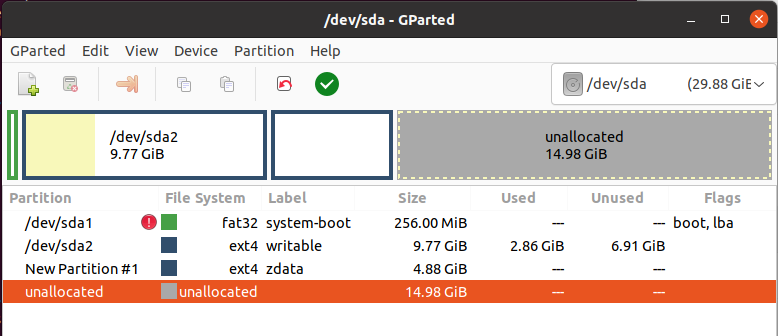

# Install Ubuntu Server image 
on Raspberry Pi 

## &nbsp;

## Image USB drive
Use Raspberry Pi Imager
link to download [Raspberry pi imager](https://www.raspberrypi.com/software/)

select "Other general purpose OS"

select "Ubuntu"

select "Ubuntu Server 21.10 (RPI2/3/4/400) 64bit(zfs) or 32bit(no zfs)

## Partition USB drive
Use Gparted to resize OS partition and add zdata partition

## Boot Rpi and Check FW
Reference link [Rpi4 Bootloader Firmware Update Guide](https://jamesachambers.com/raspberry-pi-4-bootloader-firmware-updating-recovery-guide/)

    ubuntu@ubuntu:~$ sudo apt update && sudo apt upgrade -Y
    ubuntu@ubuntu:~$ sudo reboot
    ubuntu@ubuntu:~$ sudo rpi-eeprom-update

If FW is not up to date then run
##
    ubuntu@ubuntu:~$ sudo rpi-eeprom-update -d -a
    
## Add pi user
    ubuntu@ubuntu:~$ sudo adduser pi
    ubuntu@ubuntu:~$ sudo usermod -aG sudo pi

## Add local name resolving
and change hostname
##
    ubuntu@ubuntu:~$ sudo apt install libnss-mdns
    ubuntu@ubuntu:~$ sudo nano /etc/nsswitch.conf

    hosts:          files mdns4_minimal [NOTFOUND=return] dns mdns4

    ubuntu@ubuntu:~$ sudo hostnamectl set-hostname tnfspi
    ubuntu@ubuntu:~$ sudo reboot
    alex@xanadu_pc:~$
    
## Remote ssh login 
from PC terminal to user pi at tnfspi server
##
    alex@xanadu_pc:~$ ssh pi@tnfspi.local
    pi@tnfspi:~$ 